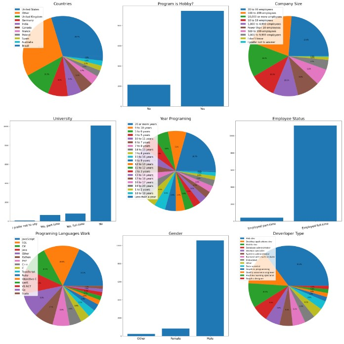
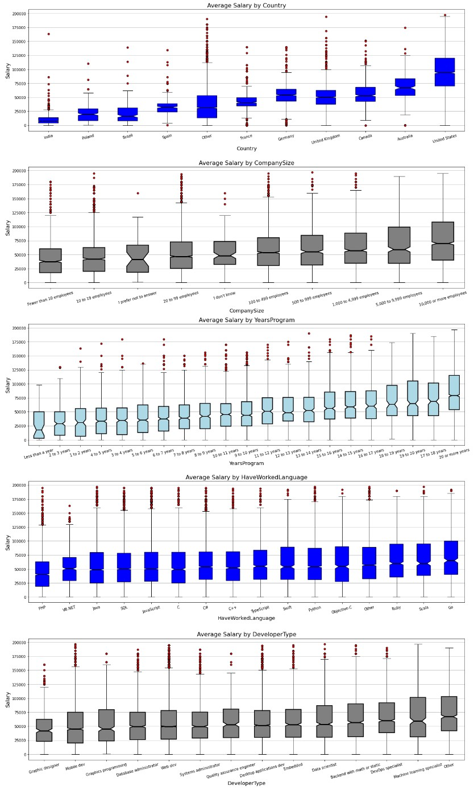
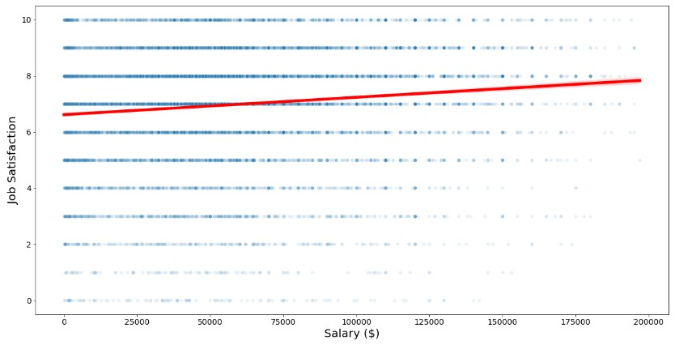

# What do you think about Data Science?

    When first time know about DS, I don't understand what is this? Don't know what mean but I start study DS, I actually like it? It is useful with my life!
    Below is example about mini project I want show to you to prove that DS is very useful.
    This project I using [Survey Data](https://www.kaggle.com/datasets/stackoverflow/so-survey-2017) to analyst
    
## Part I: What is the distribution and scale of the data?

    Before we explore the interesting things that lie behind the data, we need to look at the data distribution we use. It is essential for us to be able to evaluate the results objectively.
    

    
The image above shows some of the main ideas as follows
    - The majority of people surveyed are living and working in the US and Europe.
    - Most of the respondents have a hobby of programming, working full time, gender is male. The special thing is that a large number of them do not go to university.
    - The most used languages are JavaScript, SQL Java, PHP, Python.
    - The most chosen IT majors are Web developer, Desktop Application Developer, Mobile Developer.
    
    
## Part 2: How are their salaries?

After getting the visualizations of the salary distribution for the variables, I was really surprised by a few factors.

    - As we can see that the salary of programmers is positively correlated with the number of years of experience, the average salary of programmers increases as the number of years of experience increases. Salary is also proportional to the size of the company they are working for.
    - In addition, the salary depends on the country they are working in, the programming language they use, the IT industry they are working in or whether they work full time or part time. Especially when it comes to college graduates, those who don't have a higher average salary.
    
    
## Part 3: How satisfied is their job with the work they are doing? What is the correlation between satisfaction and salary they receive?

#### There is a saying: The higher the salary, the more employees love their work. So is that statement true or false?

    From the results of the analysis, we can see that the correlation of salary with job satisfaction is not close. There are many people whose salary is not high but still have a high level of job satisfaction, but there are also many people who have high salary but are not satisfied with the job. We can also see that the correlation coefficient between the two indexes is 0.116, which indicates that they have a low correlation.
    So it seems that the above statement is not correct

## Conclusion

#### In my article, there are a few summaries as follows::
    1. The salary of programmers depends on a few factors such as the size of the company they work for, years of experience, programming language, country of birth, ...
    2. The level of satisfaction of each person will depend on many factors and salary is only one of those factors and it is not possible to assess their satisfaction through salary.
    3. Interesting Facts to Study: Non-college-educated people have higher median salaries than college-educated people, which could be a misnomer in the data but can also be an interesting feature in the study. programming industry. This makes me want to use it as a research topic in the next section.

